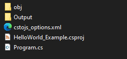
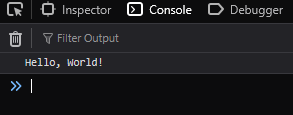

> [!NOTE]
> cstojs-cli 0.1.2 is used.

I assume that the cli installed as a dotnet tool, that way, the cli can be called as "cstojs-cli".

## Hello world
First, let's create a folder where the project will be, I called it "HelloWorld_Example".
Now, inside that folder, open a terminal and type:

```bash
cstojs-cli setup "Output"
```
The command will create a dotnet project with an "Output" folder as an output for js files.



"Output" - folder where js files will be placed.

"cstojs_options.xml" - various options for a csharptojavascript library.

Now before we start "coding" hello world :) let's create an HTML file inside of "Output", I called "index.html"

[!code-javascript[](./HelloWorld_Example/Output/index.html)]

Now in the opened terminal type:

```bash
cstojs-cli translate
```
Once translated, open "index.html" and open a console, you should see a message "Hello, World!"



Now, let's code!

Open "Program.cs" in your favorite ide, delete everything, and add this code.

[!code-csharp[](./HelloWorld_Example/Program.cs)]

Now, let me explain line by line. In the meantime, you can run `cstojs-cli translate` and see a "Hello, World!" message on a reloaded "index.html".

> [!NOTE]
> You can ignore warnings as of 0.1.2, something regressed...


1. Using static directive, this is needed if you want (you do!) to use ECMA api/web api:
[!code-csharp[](./HelloWorld_Example/Program.cs?highlight=2#L1-L3)]

2. Adding an event listener to make sure the body is loaded before js execution:
[!code-csharp[](./HelloWorld_Example/Program.cs?highlight=2#L3-L5)]

3. Keeping reference to the body:
[!code-csharp[](./HelloWorld_Example/Program.cs?highlight=2#L5-L7)]

4. This shows how to create an element and textnode, explore other methods in <xref:CSharpToJavaScript.APIs.JS.Document>:
[!code-csharp[](./HelloWorld_Example/Program.cs?highlight=2,3#L7-L10)]

5. AppendChild is easy:
[!code-csharp[](./HelloWorld_Example/Program.cs?highlight=2#L10-L12)]

6. But what about "Append"??? 
Well, you need to cast a class object to the "ParentNode" interface before you can use methods like "Append" and "QuerySelector".
See all methods <xref:CSharpToJavaScript.APIs.JS.ParentNode>.

> [!NOTE]
> As of 0.1.2, explicit cast `(ParentNode(body))` is broken, I need to fix it..

[!code-csharp[](./HelloWorld_Example/Program.cs?highlight=2#L12-L14)]

Translated js:
[!code-javascript[](./HelloWorld_Example/Output/Program.js)]

See the full source code: https://github.com/TiLied/CSTOJS_Pages/tree/main/tutorials/HelloWorld_Example

Live example:

<iframe src="./HelloWorld_Example/Output/index.html"></iframe>

## Hello world(Class edition)
You may ask, what about more traditional c#, more classical. You can do that!
1. First, create a folder and run:
```bash
cstojs-cli setup "js"
```
Why "js", why not :)

2. Copy and paste "index.html" to the "js" folder.

3. Program.cs is almost the same:
[!code-csharp[](./HelloWorldClass_Example/Program.cs)]
4. Try running `cstojs-cli translate` and open "index.html".

5. And... nothing. Well, we need to call a static method "Main" somehow.
As of 0.1.2, the only way to call it is to modify "cstojs_options.xml".
Open "cstojs_options.xml" and change the content to:
[!code-xml[](./HelloWorldClass_Example/cstojs_options.xml?highlight=4)]
6. Now, run `cstojs-cli translate` again, and here we go "Hello, World!" is showing.
See <xref:CSharpToJavaScript.CSTOJSOptions> for more options. They can be applied as a global option or local to the file. In this example, the option applied to the "Program.cs" file only.

Translated js:
[!code-javascript[](./HelloWorldClass_Example/js/Program.js)]

See the full source code: https://github.com/TiLied/CSTOJS_Pages/tree/main/tutorials/HelloWorldClass_Example

Live example:

<iframe src="./HelloWorldClass_Example/js/index.html"></iframe>
