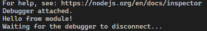

## Simple Module

> [!NOTE]
> cstojs-cli 0.1.3 is used.

As of 0.1.3, the only way to use modules is by modifying "cstojs_options.xml".

Program.cs:
[!code-csharp]

Module.cs:
[!code-csharp]

cstojs_options.xml:
[!code-xml]

Translated Program.js:
[!code-javascript]

Translated Module.js:
[!code-javascript]

Now, if you run `node ./Program.js`, you will see "Hello from module!" in the console.

See the full source code: https://github.com/TiLied/CSTOJS_Pages/tree/main/tutorials/SimpleModule_Example
