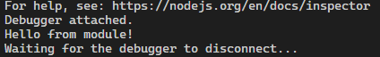

## Simple Module

## As of CSharpToJavaScript 0.2.1
There is an option [EnableModules](xref:CSharpToJavaScript.CSTOJSOptions#CSharpToJavaScript_CSTOJSOptions_EnableModules).
By default, if more than 2 files are supplied, it is enabled.

Program.cs:
[!code-csharp[](./SimpleModule_Example/Program.cs)]

Module.cs:
[!code-csharp[](./SimpleModule_Example/Module.cs)]

cstojs_options_auto.xml:
[!code-xml[](./SimpleModule_Example/cstojs_options_auto.xml)]

> [!NOTE]
> You need to run 'cstojs-cli translate --project ./cstojs_options_auto.xml'.

Translated Program.js:
[!code-javascript[](./SimpleModule_Example/Output_auto/Program.js)]

Translated Module.js:
[!code-javascript[](./SimpleModule_Example/Output_auto/Module.js)]

Now, if you run `node ./Program.js`, you will see "Hello from module!" in the console.


See the full source code: https://github.com/TiLied/CSTOJS_Pages/tree/main/tutorials/SimpleModule_Example


## As of CSharpToJavaScript 0.1.5

Using special syntax `//...\\`.
```csharp
...
//export { Hello };\\
...
```
Will be translated as:
```javascript
export { Hello };
```

## Modifying `cstojs_options.xml`.

Program.cs:
[!code-csharp[](./SimpleModule_Example/Program.cs)]

Module.cs:
[!code-csharp[](./SimpleModule_Example/Module.cs)]

cstojs_options.xml:
[!code-xml[](./SimpleModule_Example/cstojs_options.xml)]

Translated Program.js:
[!code-javascript[](./SimpleModule_Example/Output/Program.js)]

Translated Module.js:
[!code-javascript[](./SimpleModule_Example/Output/Module.js)]

Now, if you run `node ./Program.js`, you will see "Hello from module!" in the console.


See the full source code: https://github.com/TiLied/CSTOJS_Pages/tree/main/tutorials/SimpleModule_Example
